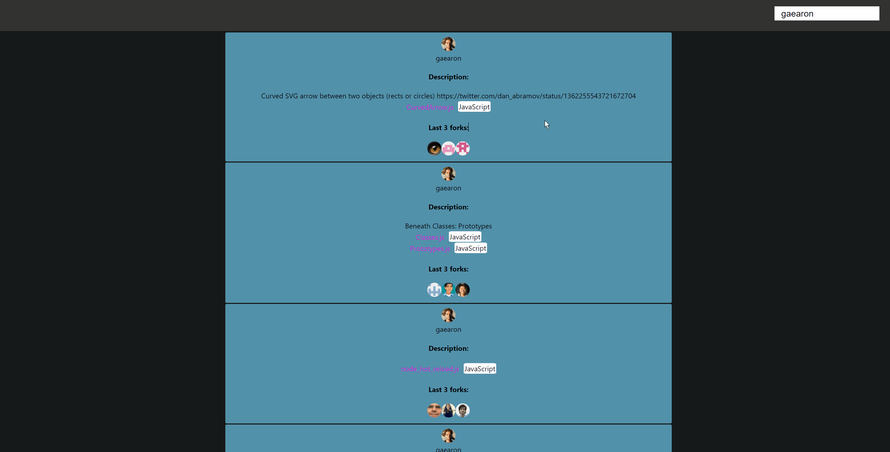
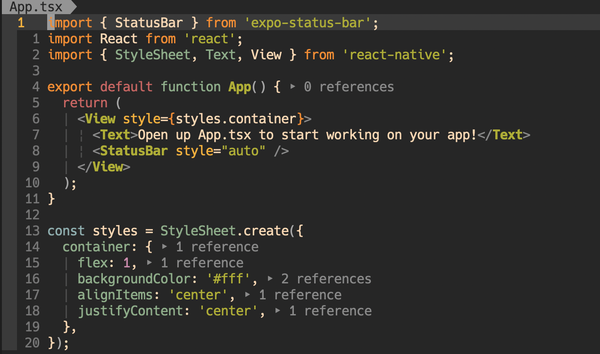

# MyGist

`mygist` lets you search in real time (if the typed user exists, it will show his gists) for a users gists on github.

# Contents

- [Usage](#usage)
- [Improvements](#improvements)
- [What did I use](#what-did-i-use)

## Usage?

After starting the program follow the next steps:

1.Search for a user in the top right search box:

2.Click on a file name from a give gist to see it's content. You can see the langauge near the file name:

## Improvements?

#### [`React Syntax Highlighter`](https://github.com/react-syntax-highlighter/react-syntax-highlighter)

To make the code contents of gists more readable, react syntax highlighter could be a big improvement.

#### `Display the gists as cards`

Display the gists as individual card, using all space available to fit as many cards as possible.

#### `Display the user and relevant data on the left side`

Display the user avatar and releveant data (name, number of gists etc) permanently on the left side. Currently we are displying the same data on all gists (avatar and name) wasting a lot of space.

#### `Clickable avatars`

Clicking on an avatar from forks could bring you to the gists of that user.

#### `Device friendly`

Use media queries to make the application responsive on any device.

## What did I use?

[`ReactJS`](https://reactjs.org/) - library for UI.

[`Axios`](https://github.com/axios/axios) - for API calls.

[`React-Router-DOM`](https://reactrouter.com/web/guides/quick-start) - for routing(single page for now).
